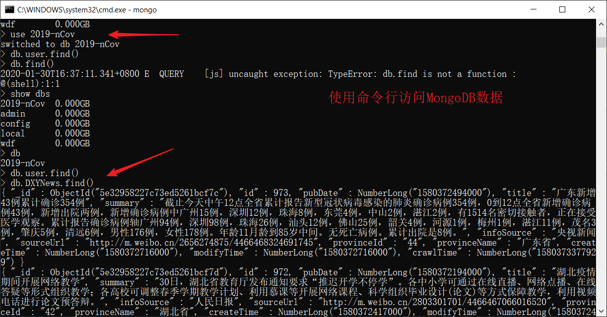
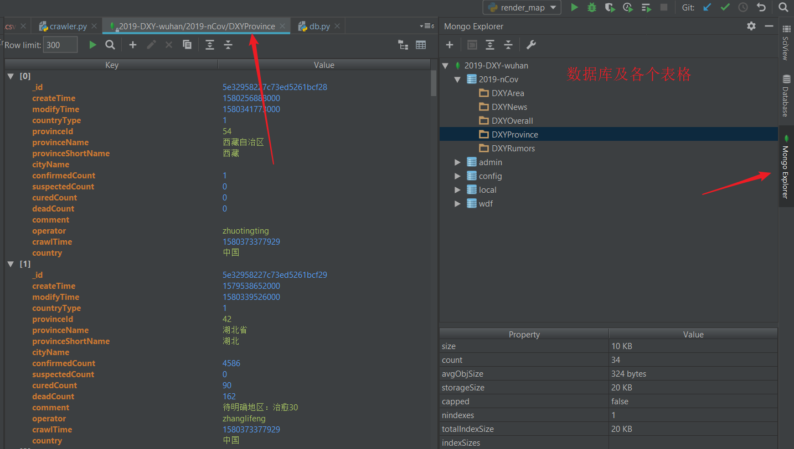
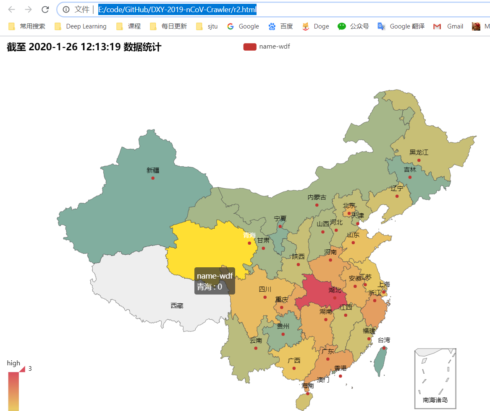

# 2019-nCov 爬虫、地图可视化

## 大纲
1. 爬虫获取数据
2. MongoDB存储数据
3. 导出数据并可视化
4. 可视化
5. 代码实现
6. reference

## 博客地址
https://weidafeng.github.io/2020/01/30/2019-ncov-pa-chong-di-tu-ke-shi-hua/


## 1. 爬虫获取数据
### requests

完成浏览器的各种操作（get、post等），本项目用requets的get方法，获取丁香园网页内容。
基本用法：
``` python
>>> import requests
>>> r = requests.get('https://www.python.org')
>>> r.status_code
200
>>> 'Python is a programming language' in r.content
True
```

```python 
# 访问丁香园网站
r = requests.session().get(url='https://3g.dxy.cn/newh5/view/pneumonia')
```

### re  

正则表达式模块，有很强大的语法，主要用于字符串的模式匹配。


### BeautifulSoup  

用于接收一个HTML或XML字符串，然后将其进行格式化，之后遍可以使用他提供的方法进行快速查找指定元素，从而使得在HTML或XML中查找指定元素变得简单。

如果只用正则表达式的话，通常需要些很长很复杂的pattern， 而借助bs，可以很方便的利用html、JavaScript、css的属性，很容易实现和理解。

```python 
soup = BeautifulSoup(r.content, 'lxml') 
overall_information = re.search(r'\{("id".*?)\}',str(soup.find('script', attrs={'id': 'getStatisticsService'})))

```

比如这一句，pattern为正则表达式格式，搜索范围用bs限制在`'getStatisticsService'`属性段内。


## 2. MongoDB存储数据

MongoDB是很常用的非关系型数据库，与之相对的是如MySQL等关系型数据库。

- 关系模型指的就是二维表格模型，而一个关系型数据库就是由二维表及其之间的联系所组成的一个数据组织。一般是一个表格链接另一个表格（通过指定字段）、再链接另一个表格。

- 非关系型数据库以键值对存储，且结构不固定，每一个元组可以有不一样的字段，每个元组可以根据需要增加一些自己的键值对，不局限于固定的结构，可以减少一些时间和空间的开销。key-value数据库的主要特点是具有极高的并发读写性能.

1. 下载安装MongoDB数据库（完全开源、免费）
	https://www.mongodb.com/  

2. 安装pymongo库
	`pip install pymongo`

3. 新建数据库  
```python 
from pymongo import MongoClient

# 使用自己的本地数据库，端口默认为27017
client = MongoClient('localhost', 27017)
# 数据库命名为2019-nCov
db = client['2019-nCov']
```

- 插入/查找字段
```python
class DB:
    def __init__(self):
        self.db = db

    def insert(self, collection, data):
        self.db[collection].insert(data)  

    def find_one(self, collection, data=None):
        return self.db[collection].find_one(data)
```  


## 3. 导出数据

爬取完毕后，可以在MongoDB数据库里查看数据，命令行方式不太友好：


可以借助一些可视化软件，我这里使用pycharm下的Mongo Plugin插件。
[安装方式](https://blog.csdn.net/wang_hugh/article/details/80547789)

结果如图：


也可以使用pymongo导出数据：
```python
# 连接mongodb数据库
client = pymongo.MongoClient("localhost", 27017)
# 连接数据库
db = client["2019-nCov"]
# 数据表
WUHAN_DB = db["DXYProvince"]

# 将mongodb中的数据读出
# 查找、过滤、排序
data = pd.DataFrame(list(WUHAN_DB.find({}, {'_id': 0, 'comment': 0, 'country': 0, 'countryType': 0, 'modifyTime': 0,'operator': 0, 'provinceName': 0, 'provinceId': 0, 'crawlTime': 0,
    'createTime': 0, 'cityName': 0, 'suspectedCount': 0}).sort('confirmedCount', pymongo.DESCENDING)))

# 保存为csv格式
data.to_csv('wuhan.csv', encoding='utf-8', index=False)

```


## 4. 可视化

借助第三方库 pyecharts 可以极其简便地实现地图形式的可视化。

- 安装：
	- pip install pyecharts==0.5.1  
	- pip install echarts-countries-pypkg   （额外安装地图，否则显示不完全）

- 使用：
简单的9行代码就能实现  

```python 
from pyecharts import Map
import numpy as np

value = np.array(
    [1052, 104, 98, 83, 75, 69, 60, 51, 44, 40, 39, 33, 31, 19, 19, 18, 18, 15, 15, 13, 11, 10, 9, 7, 7, 5, 5, 4, 4, 3, 3, 1])
value = np.log10(value)
attr = ["湖北", "浙江", "广东", "河南", "重庆", "湖南", "安徽", "北京", "四川", "上海", "山东", "广西", "江苏", "海南", "辽宁", "江西", "福建", "陕西", "黑龙江", "河北", "云南", "天津", "山西", "内蒙古", "甘肃", "香港", "贵州", "吉林", "宁夏", "台湾", "新疆", "青海"]

map = Map("截至 2020-1-26 12:13:19 数据统计", width=1000, height=800)

map.add("name-wdf", attr, value, is_map_symbol_show=True, maptype="china", is_visualmap=True, visual_text_color='#000', is_label_show=True, visual_range=[np.min(value), np.max(value)])
map.render('render.html')

```

- 结果：  


## 5. 使用说明
github： https://github.com/weidafeng/2019-nCov-Crawer-and-Visualization

usage：  
1. python main.py  # 默认每分钟爬取一次，一次爬取后可以ctrl+C 关闭
2. python render_map.py  # 地图可视化

## 6. reference
1. https://zhuanlan.zhihu.com/p/104026698 
2. https://github.com/BlankerL/DXY-2019-nCoV-Crawler
3. https://3g.dxy.cn/newh5/view/pneumonia